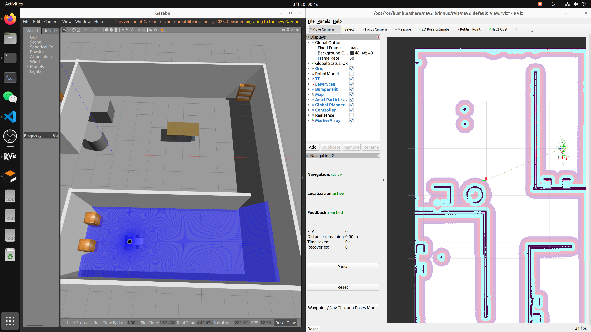
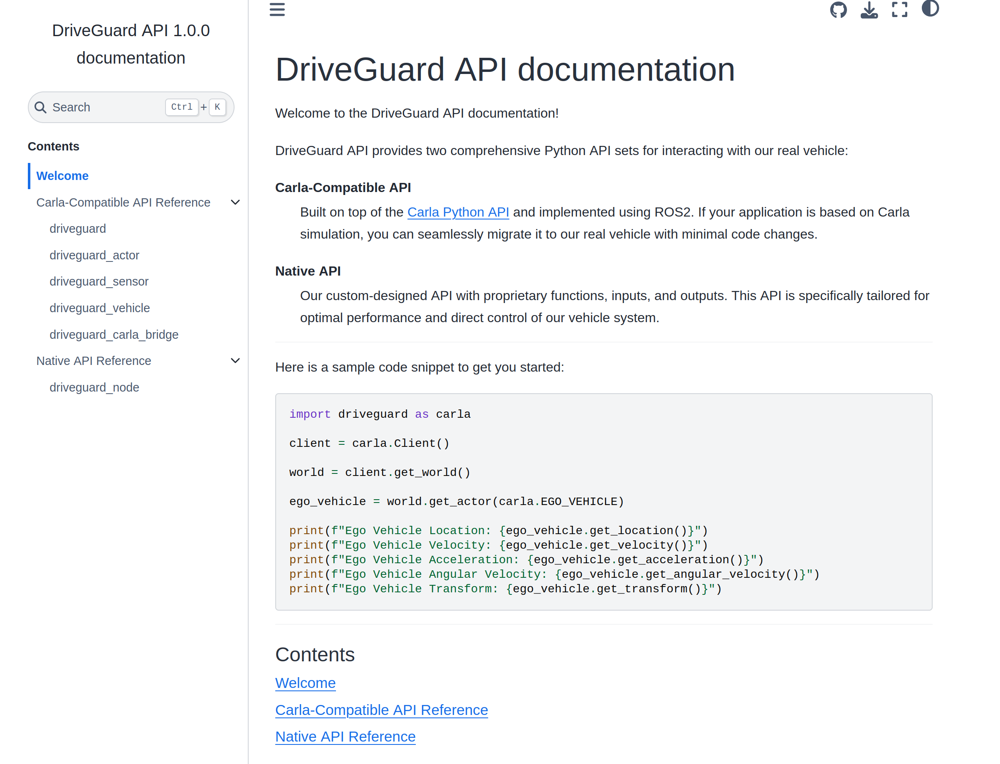

# DriveGuard

## 1.项目介绍

各功能包功能如下：
- driveguard_description 机器人模型的描述文件，包含仿真相关配置
- driveguard_cartographer 建图与定位配置
- driveguard_navigation2 导航配置
- driveguard_interface  提供易用的对外接口，屏蔽ros细节


## 2.使用方法   

- 系统版本： Ubunt22.04
- ROS 版本：ROS 2 Humble

### 2.1安装

建图采用slam-toolbox或cartographer，采用robot_localization增强定位，导航采用Navigation2 ,仿真采用Gazebo，控制采用ros2-control。

构建之前请先安装依赖包：
```
# slam_toolbox
sudo apt install ros-humble-slam-toolbox

# cartographer 
sudo apt install ros-humble-cartographer ros-humble-cartographer-ros ros-humble-cartographer-rviz

# Naviagtion2
sudo apt install ros-humble-nav2* ros-humble-slam-toolbox

# 仿真相关
sudo apt install ros-humble-robot-state-publisher  ros-humble-joint-state-publisher ros-humble-ros2-control gazebo ros-humble-gazebo-ros-pkgs ros-humble-ros2-controllers ros-humble-gazebo-ros2-control ros-humble-xacro 

# transforms3d库，转换欧拉角与四元数
sudo apt install ros-humble-tf-transformations 
pip3 install transforms3d 

# robot_localization
sudo apt install ros-humble-robot-localization

# ros2_control
sudo apt install ros-humble-ros2-control ros-humble-ros2-controllers

# opencv
sudo apt install ros-humble-cv-bridge
pip3 install opencv-python
```

### 2.2运行

安装完成依赖后，可以使用 colcon 工具进行构建和运行。

构建功能包

```
colcon build --cmake-args -DCMAKE_EXPORT_COMPILE_COMMANDS=ON
```

运行仿真

```
#两轮差速
source install/setup.bash
ros2 launch driveguard_description gazebo_sim_diff_drive.launch.py 

#阿克曼
source install/setup.bash
ros2 launch driveguard_description gazebo_sim_racecar.launch.py 
```

运行cartographer

```
source install/setup.bash
ros2 launch driveguard_cartographer cartographer.launch.py
```

运行导航

```
#两轮差速
source install/setup.bash
ros2 launch driveguard_navigation2 nav2_diff_drive.launch.py 

#阿克曼
source install/setup.bash
ros2 launch driveguard_navigation2 nav2_racecar.launch.py
```




## 3.常用命令

- 键盘控制(发布/cmd_vel)
```
ros2 run teleop_twist_keyboard teleop_twist_keyboard
```

## 4.生存API文档

### 安装sphinx
```pip3 install sphinx```

### 生成文档 (doc/out/html/index.html)
```bash
cd src/driveguard_interface/driveguard_interface/doc

./build_doc.sh
```