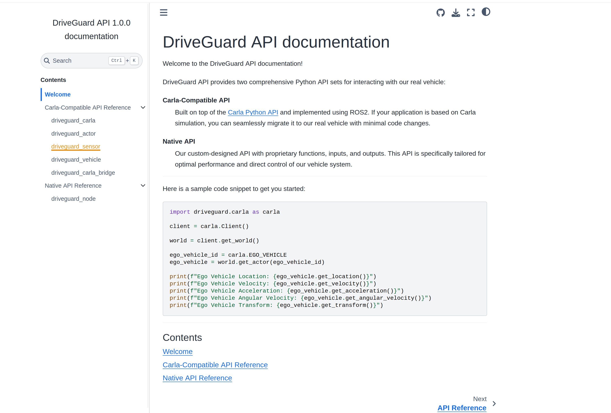

# DriveGuard

## 1.项目介绍

各功能包功能如下：
- driveguard_gazebo 仿真相关功能包
- driveguard_cartographer 建图与定位配置
- driveguard_navigation2 导航配置
- driveguard_interface  提供易用的对外接口，屏蔽ros细节
- driveguard_arbitrator  仲裁节点，提供多种导航算法的切换
- driveguard_ai AI相关功能包
- driveguard_drlnav 基于强化学习的导航功能包，使用turtlebot3作为测试平台

## 2.使用方法   

- 系统版本： Ubunt22.04
- ROS 版本：ROS 2 Humble

### 2.1安装

建图采用slam-toolbox或cartographer，采用robot_localization增强定位，导航采用Navigation2 ,仿真采用Gazebo，控制采用ros2-control。

构建之前请先安装依赖包：
```
# slam_toolbox
sudo apt install ros-humble-slam-toolbox

# cartographer 
sudo apt install ros-humble-cartographer ros-humble-cartographer-ros ros-humble-cartographer-rviz

# Naviagtion2
sudo apt install ros-humble-nav2* ros-humble-slam-toolbox

# 仿真相关
sudo apt install ros-humble-robot-state-publisher  ros-humble-joint-state-publisher ros-humble-ros2-control gazebo ros-humble-gazebo-ros-pkgs ros-humble-ros2-controllers ros-humble-gazebo-ros2-control ros-humble-xacro 

# transforms3d库，转换欧拉角与四元数
sudo apt install ros-humble-tf-transformations 
pip3 install transforms3d 

# robot_localization
sudo apt install ros-humble-robot-localization

# ros2_control
sudo apt install ros-humble-ros2-control ros-humble-ros2-controllers

# opencv
sudo apt install ros-humble-cv-bridge
pip3 install opencv-python

# calar python api
pip3 install carla

# 视觉控制相关依赖
pip3 install torch torchvision torchaudio matplotlib tensorboard tqdm
```

### 2.2 运行Nav2导航

安装完成依赖后，可以使用 colcon 工具进行构建和运行。

- 构建功能包
```
colcon build --cmake-args -DCMAKE_EXPORT_COMPILE_COMMANDS=ON
```

- 运行仿真
```
#两轮差速
source setup.sh
ros2 launch driveguard_gazebo gazebo_sim_diff_drive.launch.py 

#阿克曼
source setup.sh
ros2 launch driveguard_gazebo gazebo_sim_racecar.launch.py
```

- 运行cartographer
```
source setup.sh
ros2 launch driveguard_cartographer cartographer.launch.py
```

- 运行导航
```
#两轮差速
source setup.sh
# option:use_arbitrator 启用仲裁节点
ros2 launch driveguard_navigation2 nav2_diff_drive.launch.py # :use_arbitrator=true

#阿克曼
source setup.sh
# option:use_arbitrator
ros2 launch driveguard_navigation2 nav2_racecar.launch.py # :use_arbitrator=true
```


### 2.3 运行强化学习导航

<p float="left">
 
 
</p>

- 启动gazebo
    ```
    source setup.sh
    ros2 launch turtlebot3_gazebo turtlebot3_drl_stage4.launch.py
    ```

- 启动强化学习环境
    ```
    source setup.sh
    ros2 run turtlebot3_drl environment
    ```

- 目标点发布
    ```
    source setup.sh
    ros2 run turtlebot3_drl gazebo_goals
    ```

- 强化学习训练

    For DDPG:
    ```
    source setup.sh
    ros2 run turtlebot3_drl train_agent ddpg
    ```

    for TD3:
    ```
    ros2 run turtlebot3_drl train_agent td3
    ```

    for DQN:
    ```
    ros2 run turtlebot3_drl train_agent dqn
    ```

详见 [driveguard_drlnav](src/driveguard_drlnav/README.md)

### 2.4 视觉控制

基于深度学习的端到端视觉控制功能，通过摄像头图像直接预测机器人的运动控制命令。

#### 2.4.1 数据收集

首先需要收集训练数据，通过"手动/Nav2"控制机器人收集图像和对应的控制命令：

```bash
# 记录数据 (默认10秒)
ros2 run driveguard_interface vision_control record --duration 30

# 指定输出目录和包名
ros2 run driveguard_interface vision_control record --duration 30 --out_dir ~/my_data --bag_name manual_control_data
```

#### 2.4.2 数据集生成

从录制的ROS2 bag文件生成训练数据集：

```bash
# 从bag文件生成数据集
ros2 run driveguard_interface vision_control generate --name my_dataset

# 指定特定的bag文件
ros2 run driveguard_interface vision_control generate --name my_dataset --bag /path/to/bag/file
```

#### 2.4.3 模型训练

使用生成的数据集训练视觉控制模型：

```bash
# 训练模型
ros2 run driveguard_interface vision_control train --dataset my_dataset --model_name my_model --epochs 100

# 指定更多训练参数
ros2 run driveguard_interface vision_control train --dataset my_dataset --model_name my_model --epochs 200 --batch_size 64 --learning_rate 0.0001
```

#### 2.4.4 模型评估

评估训练好的模型性能：

```bash
# 评估模型
ros2 run driveguard_interface vision_control evaluate --model my_model --dataset my_dataset
```

#### 2.4.5 实时推理

使用训练好的模型进行实时视觉控制：

```bash
# 启动实时推理 (交互式选择模型)
ros2 run driveguard_interface vision_control inference

# 指定模型名称
ros2 run driveguard_interface vision_control inference --model my_model

# 自定义参数
ros2 run driveguard_interface vision_control inference --model my_model --rate 20 --max_linear 0.8 --max_angular 1.5
```

#### 2.4.6 单张图像测试

测试模型对单张图像的预测：

```bash
# 测试单张图像预测
ros2 run driveguard_interface vision_control test --model my_model --image /path/to/image.jpg
```

#### 2.4.7 查看可用资源

查看所有可用的数据集、模型和bag文件：

```bash
# 列出所有可用资源
ros2 run driveguard_interface vision_control list
```

#### 2.4.8 输出目录结构

视觉控制系统的输出目录结构如下：

```
out/
├── datasets/
│   └── {DATASET_NAME}/
│       ├── images/
│       ├── data.csv
│       └── metadata.json
├── ros2bags/
│   └── {BAG_NAME}/
│       ├── {BAG_NAME}_0.db3
│       └── metadata.yaml
└── models/
    └── {MODEL_NAME}/
        ├── metrics/           # 训练指标图表
        ├── checkpoints/       # 模型检查点
        ├── best_model.pth     # 最佳模型
        └── metadata.json      # 训练元数据
```

## 3.常用命令

- 键盘控制(发布/cmd_vel)
```
ros2 run teleop_twist_keyboard teleop_twist_keyboard
```

## 4.生成API文档

### 安装sphinx
```sh
pip3 install sphinx
pip install sphinx-book-theme
```
### build
```bash
cd src/driveguard_interface/docs
./build.sh
```
