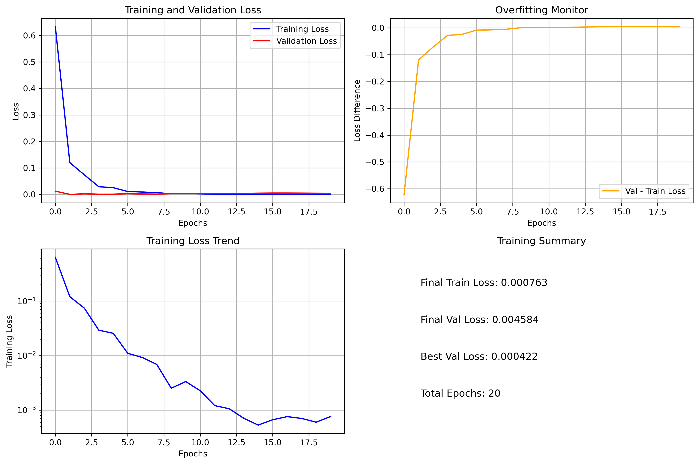
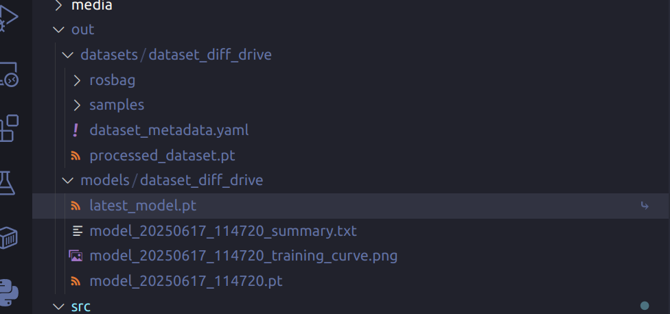

# driveguard_ai

## Overview
`driveguard_ai` is a ROS2 Python package designed for collecting data, training AI models using PyTorch, and performing inference for autonomous driving applications. The package primarily focuses on processing image data and generating command outputs based on trained models.

## Features
- **Data Collection**: Records/Processes `image` and `cmd_vel` data from ROS topics
- **Model Training**: Trains a ResNet18 model using the collected data, with built-in preprocessing to resize images to 224x224 pixels.
- **Inference Node**: Subscribes to image topics and publishes command outputs based on the trained model.

## Usage

```sh

colcon build --package-select driveguard_ai
source install/setup.bash

```

### Data Collection / Model Training
```sh


ros2 launch driveguard_description gazebo_sim_diff_drive.launch.py #两轮差速，上面有摄像头，发布/camera_sensor/image_raw
ros2 run teleop_twist_keyboard teleop_twist_keyboard #随便按几下，发布/cmd_vel

# 记录数据
ros2 run driveguard_ai record_data --dataset-name my_dataset --duration 30

# 处理数据
ros2 run driveguard_ai process_data --dataset-name my_dataset

# 列出数据集
ros2 run driveguard_ai process_data --list

```

```sh
# 训练模型
ros2 run driveguard_ai train_model --dataset-name my_dataset
```




### Inference Node
```sh
ros2 launch driveguard_ai inference_node.launch.py
```
