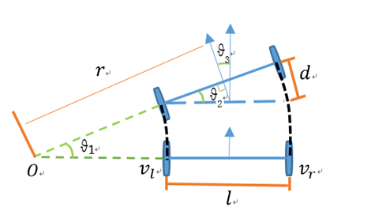

# driveguard_description 仿真

包含内容：
- urdf机器人建模语言
- gazebo仿真平台
- 控制(真实/仿真)机器人移动

## URDF 机器人建模语言
urdf是ros支持的机器人建模语言（xml格式）。
```xml
<!-- 轮子 -->
<xacro:macro name="wheel_xacro" params="wheel_name xyz">
    <link name="${wheel_name}_wheel_link">
        <visual>
            <!-- 几何信息 -->
            <origin xyz="0 0 0" rpy="1.57079 0 0" />
            <geometry>
                <cylinder length="0.04" radius="0.032" />
            </geometry>
            <material name="black">
                <color rgba="0.0 0.0 0.0 0.8"/>
            </material>
        </visual>
        <collision>
            <!-- 碰撞信息 -->
            <origin xyz="0 0 0" rpy="1.57079 0 0" />
            <geometry>
                <cylinder length="0.04" radius="0.032" />
            </geometry>
            <material name="black">
                <color rgba="0.0 0.0 0.0 0.8"/>
            </material>
        </collision>
        <xacro:cylinder_inertia m="0.1" h="0.04" r="0.032"/>
    </link>
</xacro:macro>
```

上面的代码中使用了xacro定义模板，`<link>... </link>`之间的才是urdf建模语法。用xacro的好处是：比如机器人有两个轮子，他们只是放置的位置、名字不一样。如果直接用urdf写，相同的代码要写两遍。而xacro可以将预先写好的模板include进来，然后实例化。

你可以在`driveguard.urdf.xacro`看到下面的代码：
```xml
<!-- include模板 -->
<xacro:include filename="$(find driveguard_description)/urdf/driveguard/actuator/wheel.urdf.xacro" />

<!-- 实例化 -->
<xacro:wheel_xacro wheel_name="left" xyz="0 0.10 -0.06" />
<xacro:wheel_xacro wheel_name="right" xyz="0 -0.10 -0.06" />

```
ros只认urdf格式。使用`xacro`命令行工具可以将xacro转为urdf(宏展开)，在`launch/gazebo_sim.launch.py`中有一行代码就是在python中调用命令行工具将`driveguard.urdf.xacro`进行转为`urdf`：
```python
# gazebo_sim.launch.py

# 默认的模型文件路径
urdf_tutorial_path = get_package_share_directory('driveguard_description')
default_model_path = urdf_tutorial_path + '/urdf/driveguard/driveguard.urdf.xacro'

# 定义launch时的arg，用于指定模型路径，保存在`model`中，默认就是上面的`driveguard.urdf.xacro`
action_declare_arg_mode_path = launch.actions.DeclareLaunchArgument(
    name='model', default_value=str(default_model_path),
    description='URDF 的绝对路径')

# 将`model`对应的xacro文件转为urdf文件
robot_description = launch_ros.parameter_descriptions.ParameterValue(
    launch.substitutions.Command(
        ['xacro ', launch.substitutions.LaunchConfiguration('model')]
    ),
    value_type=str
)

# 将机器人模型发布到在/robot_description话题下
robot_state_publisher_node = launch_ros.actions.Node(
    package='robot_state_publisher',
    executable='robot_state_publisher',
    parameters=[{'robot_description': robot_description}]
)
```

## gazebo仿真平台

gazebo与ros是两套系统。`gazebo-ros`包用于连同两者。gazebo-ros属于ros侧的包，使用其中的node可以启动gazebo，并把ros侧的模型加载到gazebo侧。ros侧的模型也是通过topic发布，我发布在`/robot_description`。

```python
# gazebo_sim.launch.py

# 启动gazebo并加载地图
launch_gazebo = launch.actions.IncludeLaunchDescription(
    PythonLaunchDescriptionSource([get_package_share_directory(
        'gazebo_ros'), '/launch', '/gazebo.launch.py']),
    launch_arguments=[('world', default_world_path),('verbose','true')]
)

# 让gazebo加载ros机器人
spawn_entity_node = launch_ros.actions.Node(
    package='gazebo_ros',
    executable='spawn_entity.py',
    arguments=['-topic', '/robot_description',
                '-entity', "driveguard", ])
```

## 控制(真实/仿真)机器人移动

ros是如何控制 真实/仿真机器人 移动的？你不会以为发送一个`cmd_vel`就能让轮子动起来吧？

话题`cmd_vel`中的msg格式为`geometry_msgs/msg/Twist`：
```txt
Vector3  linear
	float64 x
	float64 y
	float64 z
Vector3  angular
	float64 x
	float64 y
	float64 z
```
他描述了车辆的**目标线速度**和**目标角速度**，这是high level的描述。对于真实/仿真机器人，要结合运动学模型将`cmd_vel`的数据进行转化，具体到每个轮子的速度。

已知机器人线速度和角速度，求解每个轮子的速度，被称为**运动学逆解算**。反之，为**运动学正解算**。

---

我们的driveguard仿真模型是两轮差速模型，通过两个轮子不同的转速实现转向。


- 两轮差速-正解算

假设机器人在一小段时间 $ t $ 内，它的左右轮子线速度 $ v_l $ 和 $ v_r $ 保持不变 ，两轮之间的安装间距 $ l $，求机器人的线速度 $ v $，角速度 $ \omega $。

根据上图来推导，因为机器人的线速度方向和轮子转动方向始终保持一致，所以机器人的线速度为左右轮线速度的平均值，即：

$$ v = \frac{v_l + v_r}{2} $$

我们知道 $ v = \omega \cdot r $，根据上图所以有：

$$ l = r_r - r_l = \frac{v_r}{\omega} - \frac{v_l}{\omega} $$

同一个机器人角速度相同，所以有：

$$ \omega_l = \omega_r $$

可以求出：

$$ \omega = \frac{v_r - v_l}{l} $$

- 两轮差速-逆解算

我们直接用正解结果进行求逆解即可。

$$ v = \frac{v_l + v_r}{2} $$

$$ \omega = \frac{v_r - v_l}{l} $$

所以有：

$$ v_l = v - \frac{\omega l}{2} $$

$$ v_r = v + \frac{\omega l}{2} $$

> 这是基本原理，其实有更加精准的几何计算方法。

- 轮式里程计 /odom->/base_link

在某一个时间段 $ t $ 中，通过硬件记录的每个轮子的转速，经过正解算可得：机器人的线速度 $ v_t $ ，角速度 $ \omega_t $ 。

设机器人在初始时刻的位置为 $ x_t, y_t $ 朝向为 $ \theta_t $ ，求经过 $ t $ 时刻是机器人新的位置和朝向，这一过程中假设机器人仅在平面上运动。

在这一段时间内机器人前进的距离为 $ d $

$$ d = v_t \cdot t $$

转过的角度为 $ \theta $

$$ \theta = \omega_t \cdot t $$

则机器人新的角度为

$$ \theta_{t+1} = \theta_t + \theta $$

我们将机器人前进的距离根据其朝向分解为在 $ x $ 和 $ y $ 轴上的位移量，则可得出

$$ x_{t+1} = x_t + d \cdot \cos(\theta_{t+1}) $$

$$ y_{t+1} = y_t + d \cdot \sin(\theta_{t+1}) $$

---

在gazebo_ros提供了两轮差速模型解算的plugin：`libgazebo_ros_diff_drive.so`。
> cpp实现： https://github.com/ros-simulation/gazebo_ros_pkgs/blob/noetic-devel/gazebo_plugins/src/gazebo_ros_diff_drive.cpp

gazebo在接收到ros传来的`cmd_vel`后，进行解算，同时计算（轮式）里程计，并发布/odom->/base_link的tf。

用法如下：
`plugins/gazebo_control_plugin.xacro`被include到`driveguard.urdf.xacro`中。`<gazebo>...</gazebo>`之间的内容是专给gazebo看的，ros会忽略它，因为它不是模型定义。
```xml
<xacro:macro name="gazebo_control_plugin">
    <gazebo>
        <plugin name='diff_drive' filename='libgazebo_ros_diff_drive.so'>
            <ros>
                <namespace>/</namespace>
                <remapping>cmd_vel:=cmd_vel</remapping>
                <remapping>odom:=odom</remapping>
            </ros>
            <update_rate>30</update_rate>
            <!-- wheels -->
            <left_joint>left_wheel_joint</left_joint>
            <right_joint>right_wheel_joint</right_joint>
            <!-- kinematics -->
            <wheel_separation>0.2</wheel_separation>
            <wheel_diameter>0.064</wheel_diameter>
            <!-- limits -->
            <max_wheel_torque>20</max_wheel_torque>
            <max_wheel_acceleration>1.0</max_wheel_acceleration>
            <!-- output -->
            <publish_odom>true</publish_odom>
            <publish_odom_tf>true</publish_odom_tf>
            <publish_wheel_tf>true</publish_wheel_tf>

            <odometry_frame>odom</odometry_frame>
            <robot_base_frame>base_footprint</robot_base_frame>
        </plugin>
    </gazebo>
</xacro:macro>
```
