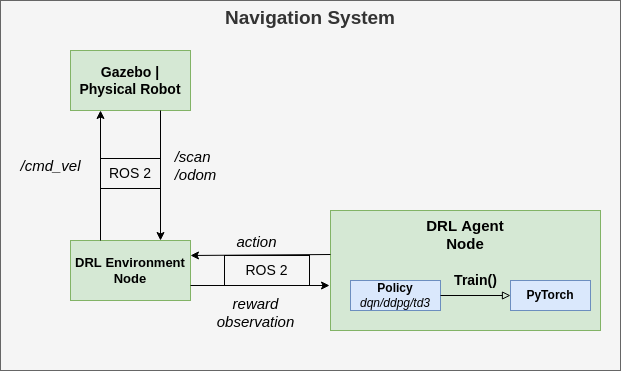

# Mobile Robot DRL Navigation

### A ROS2 framework for DRL autonomous navigation on mobile robots with LiDAR.
<p float="left">
 
 
</p>


# **Table of contents**
* [Introduction](#introduction)
* [Training](#training)
  * [Loading a Stored Model](#loading-a-stored-model)
  * [Optional Configuration](#optional-configuration)
  * [Utilities](#utilities)
* [Physical Robot](#physical-robot)

# **Introduction**

This repository contains a ROS2 and PyTorch framework for developing and experimenting with deep reinforcement learning for autonomous navigation on mobile robots. Models are trained in simulation and evaluated either in simulation or on a real-world robot. The robot model used in this repository is based on the turtlebot3. However, the framework can be used for any robot model that can provide LiDAR and odometry information and work with linear velocity messages.

Below are a few examples of what the current framework can be used for:

* Train, store, load, and evaluate a navigation agent in simulation in different environments
* Deploy an existing model on a real robot to perform navigation and obstacle avoidance
* Evaluate the effect of different hyperparameters on training time and performance
* Experiment with additional capabilities (backward motion, frame stacking)
* Implement your own DRL algorithm (currently includes: DQN, DDPG, TD3)

# **Training**



## **Running and training the DRL agent!**

Now that we have finally completed the setup, all that's left to do is run and train the agent.

Open up four different terminals however you like (I recommended using `terminator` or `tmux` for multi-tab). In the first terminal run
```
source setup.sh
ros2 launch turtlebot3_gazebo turtlebot3_drl_stage4.launch.py
```
You should see the gazebo GUI come up with the robot model loaded and two moving obstacles (this might take a while to load).
**Note: make sure to run the 'launch' command first before any other nodes as it will set the stage parameter.**

In a second terminal run
```
source setup.sh
ros2 run turtlebot3_drl environment
```

In a third terminal run
```
source setup.sh
ros2 run turtlebot3_drl gazebo_goals
```

And lastly, in the fourth terminal run the ddpg agent
For DDPG:
```
source setup.sh
ros2 run turtlebot3_drl train_agent ddpg
```

The first argument indicates whether we are testing or training (0 = testing, 1 = training)

<!-- *optional arguments:*
- The second argument indicates the name of the model if we are continuing training (e.g. "path/to/model/ddpg_1")
- The third argument indicates from which episode to continue training -->

for TD3:
```
ros2 run turtlebot3_drl train_agent td3
```

for DQN:
```
ros2 run turtlebot3_drl train_agent dqn
```

Your robot should now be moving and training progress is being printed to the terminals!

**Note**: The matplotlib graph will initially be empty but will be displayed after the first `GRAPH_DRAW_INTERVAL` episodes configured in `settings.py`. During testing, terminal output is used instead of the graph.

The state of your model will be stored automatically every `STORE_MODEL_INTERVAL` episodes configured in `settings.py`.
You will find the trained model, logfiles, and graphs in the model directory: `model/[HOSTNAME]/[MODEL_NAME]`. Training results per episode are stored in a sequential text file.

Now you have everything up and running to train your model. There are several additional options and utilities available for training which will be discussed below.

## Loading a stored model

The current state of the agent (weights, parameters, replay buffer, and graphs) will be stored automatically every N episodes as configured by the `store_interval` variable in the `common/settings.py` file.

In order to load a model for testing (e.g. ddpg_0 at episode 500) the following command should be used:

```
ros2 run turtlebot3_drl test_agent ddpg "ddpg_0" 500
```

In order to load a model to continue training (e.g. ddpg_0 at episode 500) the following command should be used:

```
ros2 run turtlebot3_drl train_agent ddpg "ddpg_0" 500
```

**Note:** You can also test (or continue training) a model on a different stage than where it was originally trained on.

### Loading one of the included example models

Two examples are included for a DDPG and TD3 model. In order to run them, open four terminals like before and run:

Terminal 1:
```
ros2 launch turtlebot3_gazebo turtlebot3_drl_stage9.launch.py
```

Terminal 2:
```
ros2 run turtlebot3_drl gazebo_goals
```

Terminal 3:
```
ros2 run turtlebot3_drl environment
```

Terminal 4:
For DDPG:
```
ros2 run turtlebot3_drl test_agent ddpg 'examples/ddpg_0' 8000
```

Or, for TD3
```
ros2 run turtlebot3_drl test_agent td3 'examples/td3_0' 7400
```

You should then see the example model navigate successfully toward the goal

### Switching environments

You can switch between 10 different environments by changing the stage number in the launch command:
```
ros2 launch turtlebot3_gazebo turtlebot3_drl_stage5.launch.py
```

change `stage5` to any stage between 1-10 to train on different environments.

## **Optional Configuration**

### Settings: change parameters

The `settings.py` file contains most of the interesting parameters that you might wish to change, including the DRL hyperparameters.

### Reward: tweak reward design

The `reward.py` file contains the reward design. Here you can implement different reward functions between which you can switch in the `settings.py` file. For example, to define a new reward function `"B"` you simply add `get_reward_B(...)` to `reward.py` and define the reward per step.

### Backward motion

To enable the robot to also move in the backward direction simply set `ENABLE_BACKWARD` to `True` in `settings.py`.

### Stacking

'Frame stacking' can enable the robot to consider the direction in which obstacles are moving. The robot considers multiple subsequent laser scan frames instead of a single frame at each step. To enable frame stacking, set `ENABLE_STACKING` to `True` in `settings.py`. Also define `STACK_DEPTH` (number of frames per step) and `FRAME_SKIP` (number of frames to skip between two frames in the stack).

## **Utilities**
### Graph Generation

In order to compare results the repository includes a script that graphs the reward curves for different models. The script `reward_graph.py` can be found in the `util` directory.

To compare the reward curve for `ddpg_0` and `td3_0` every 100 episodes we type:
```
python3 util/reward_graph.py 100 examples/ddpg_0 examples/td3_0
```

Again, `examples/` should not be included in the path for your own models.

**Note: graph generation will only work correctly if training has not been stopped and continued. Otherwise you first need to merge the different _train_stage*.txt files into a single file**

### Cleaning model data

Training models can generate a lot of data, especially if you save the model often. In order to automatically clean models to save space, two cleaning scripts are included in the `util` folder.

**CAUTION: use the following scripts with caution as deleted data cannot be retrieved! Carefully examine the script settings and double-check the command line arguments you enter**

The following line will clean ddpg_0 removing all saved model states except:
* The model state for the 4 best-performing episodes
* The model state for the most recent episode
`python3 util/clean_single_model.py ddpg_0`

If you want to keep more or less data you can adjust the `TOP_EPISODES` parameters in the script itself.

To clean all of the models at once you can use the `purge_all_models.py` script. Carefully check the parameters at the top of the file before executing the script. To execute the script simply type:
```python3 util/purge_all_models.py```

The script will loop through all of your models and select the models to keep like explained above. In addition, models which scored too low or were trained for too few episodes will be removed completely (threshold specified in `purge_all_models.py`).

### Visualization


To enable a complete visualization of the neural network neuron activity and biases simply set `ENABLE_VISUAL` to `True` in `settings.py`. This requires the python3 packages `pyqtgraph` and `PyQt5` to be installed.
The visual should mainly be used during evaluation as it can slow down training significantly.
## Command Specification

**train_agent:**

```ros2 run turtlebot3_drl train_agent [algorithm=dqn/ddpg/td3] [loadmodel=\path\to\model] [loadepisode=episode] ```

* `algorithm`: algorithm to run, one of either: `dqn`, `ddpg`, `td3`
* `modelpath`: path to the model to be loaded to continue training
* `loadepisode`: is the episode to load from `modelpath`

**test_agent:**

```ros2 run turtlebot3_drl test_agent [algorithm=dqn/ddpg/td3] [loadmodel=\path\to\model] [loadepisode=episode] ```

* `algorithm`: algorithm to run, one of either: `dqn`, `ddpg`, `td3`
* `modelpath`: path to model to be loaded for testing
* `loadepisode`: is the episode to load from `modelpath`

# Physical Robot

The models trained using this framework were validated on a low-cost physical system. Video demonstrations can be found on my [YouTube channel](https://www.youtube.com/@tomasvr1/videos).


The are three main requirements for a robot to be compatible with this project:
* The robot needs to provide LiDAR scan information
* The robot needs to provide any kind of odometry information (e.g. tachometers, SLAM, AMCL or GPS)
* The robot needs to be able to work with linear and angular velocity messages

To run one of your models (trained in simulation) on a physical robot follow these steps:
* In settings.py, adjust the REAL ROBOT ENVIRONMENT SETTINGS
  * **REAL_TOPIC**: Set the right ROS topics for your laser scan, odometry and velocity inputs/outputs
  * **REAL_N_SCAN_SAMPLES**: Configure the number of Lidar samples your robot will provide
  * **REAL_LIDAR_CORRECTION**: Depending on the dimensions of your robot the LiDAR values might need to be corrected to avoid the agent from detecting a 'collision' when the robot has not yet actually collided with any obstacle. This value is simply subtracted from the real LiDAR readings and finding the right value requires some trial and error.
  * Set the remaining options such as the arena dimensions, max velocities, max LiDAR distance, and goal and collision thresholds.

Next, when using a physical robot we do not need to run the gazebo simulation node or the gazebo_goals node. We will however still need to run an environment node and an agent node.

At this point, turn on the robot and initialize all of its components. Ensure that:
* LiDAR scan ROS messages are being sent over the configured TOPIC_SCAN topic
* Odometry ROS messages are being sent over the TOPIC_ODOM topic
* The robot is listening for velocity ROS messages on the TOPIC_VELO topic.

**Note:** If you are running nodes on multiple machines (e.g. one laptop and one robot) ensure that all machines have the same value set for `ROS_DOMAIN_ID` in `~/.bashrc`:

`export ROS_DOMAIN_ID=[X]` (X can be any number as long as it is the same for each machine).

Also ensure that all machines are connected to the same Local Area Network (LAN).

Now, open a terminal on your laptop (or robot) and run the environment node for a real robot:
```
ros2 run turtlebot3_drl real_environment
```

Then, open another terminal and run the agent node for a real robot (substitute your model name and desired episode to load):
```
ros2 run turtlebot3_drl real_agent [ALGORITHM_NAME] [MODEL_NAME] [MODEL_EPISODE]
```
For example:
```
ros2 run turtlebot3_drl real_agent ddpg ddpg_1_stage4 1000
```

If everything loads correctly, you can now use the included script to generate a goal at location (x=1, y=1):
```
./spawn_goal 1 1
```

**And that's it!** You should now see the robot start moving toward the goal while avoiding obstacles.

**Note:** You can use RViz2 in order to visualize the LiDAR scans for debugging and fine-tuning the REAL_LIDAR_CORRECTION value: simply add a `laser_scan` display type and set its topic to `TOPIC_SCAN`.
